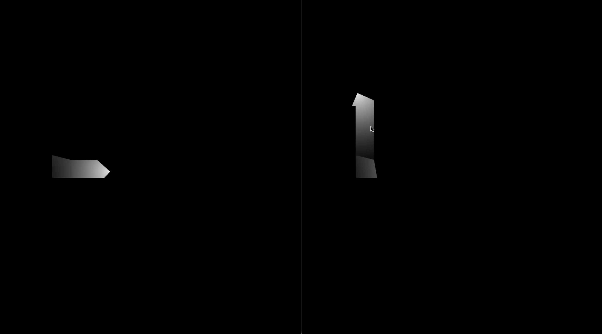

# torch-js

Multi-player Torch game built in JS

Simple express + websockets server to manage a multi player dungeon where each player can only see the area lit by the torch they are carrying.

Read more at [https://thingsinjars.com/post/538/torch-again/](https://thingsinjars.com/post/538/torch-again/) and read the original game design here: [https://thingsinjars.com/post/401/torch/](https://thingsinjars.com/post/401/torch/)